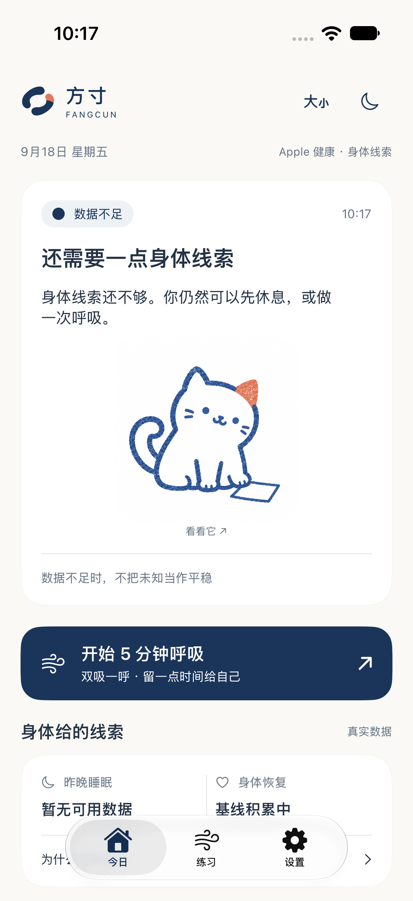
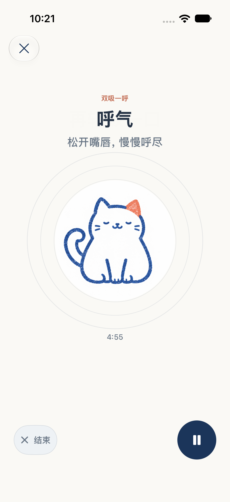
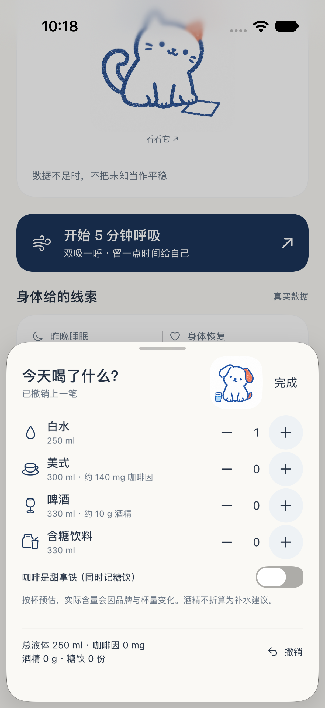

# 方寸 Fangcun

留一方余地，给自己一点缓冲。

方寸是一个以身体数据为线索、提供呼吸与恢复练习的 iOS App，带有 watchOS 伴侣。本仓库汇总当前原生实现、可运行网页原型、猫狗角色、品牌资产、设计方案与验证记录。

**给 GPT / AI 阅读：[AI_CONTEXT.md](AI_CONTEXT.md)** · [完整文件索引](FILE_INDEX.md) · [分卷源码文本](ai/README.md) · [当前交付状态](docs/verification/STATUS.md)

## 当前版本

2026-09-19 开发分支的最新成果见 [体验与饮品关怀 V2 审阅](docs/plans/fangcun-experience-v2/REVIEW.md)。以下 9 月 18 日截图为历史设计基线；当前真实 SwiftUI 截图、测试和安装状态以 V2 报告为准。

2026-09-18：整套新版已迁入 SwiftUI，并将最终修复版覆盖安装、启动于开发者的 iPhone 16 Pro。不是仅替换 Logo，也不是将网页套进手机 App。安装与测试的公开摘要见验证目录；原始设备标识和签名留在本机。

| 今日首页 | 呼吸练习 | 饮品记录 |
| --- | --- | --- |
|  |  |  |

以上为原生 App 的模拟器截图。健康状态演示截图仅用于 UI 验证，不是用户的健康记录。

## 已实现

- 今日结论、依据摘要和详情；依据真实 HealthKit 数据及个人基线，缺少数据时明确显示数据不足。
- 已确认的蓝橙双色版画猫狗；按平稳、休息、观察、饮品记录、呼吸和结束分别出场。保留独处场景，减少动态效果时停止角色变形。
- 一键开始 5 分钟双吸一呼；共用练习时钟驱动阶段和胸腹动效；暂停、继续、提前结束、保存和返回首页。
- 饮品半屏记录，支持复合增减与撤销；甜咖啡同时累计咖啡因和糖饮，但不重复累计体积。
- 7 天真实状态快照、饮品和既有练习记录；不虚构过去的数据。
- 深浅色、较大字号、减少动态效果；沿用本机存储、健康授权和现有其他练习。

## 目录

| 路径 | 内容 |
| --- | --- |
| `InnerBalance/` | iOS / watchOS Xcode 工程、原生资源、App 与 UI 测试 |
| `InnerBalanceCore/` | 独立 Swift Package：状态评估、练习、健康数据领域逻辑与测试 |
| `web/` | React 高保真交互原型、角色工作室、品牌工作室、原始完整设计规格 |
| `web/public/characters/` | v3 / v4 原画；v4 猫狗为当前主形象，呼吸沿用 v3 |
| `web/public/brand/` | 留一方余地 Logo、深浅色 App 图标、品牌素材包 |
| `design/brief/` | 整套 UI 设计提示词、用户确认的双角色参考图 |
| `design/proposals/` | 早期三套界面方案，用于追溯设计过程 |
| `design/claude-proposal-c/` | 用户提供的 Claude 方案 C 与可视化 |
| `docs/design/` | 原生迁移说明、早期猫狗探索及角色规范 |
| `docs/plans/` | 历史计划，不能作为当前实现或发布状态 |
| `docs/verification/` | 原生实测截图、测试与真机安装摘要 |
| `ai/` | 可直接通过公开 raw URL 阅读的分卷源码文本 |

## 运行网页原型

需要 Node.js 22.12+（或满足 Vite 8 要求的较新版本）。

```sh
cd web
npm ci
npm run dev
```

打开 `http://127.0.0.1:4173/`；角色工作室为 `/character-studio.html`，品牌工作室为 `/brand-studio.html`。

```sh
npm test
npm run build
```

网页采用 Mock 健康数据，存储在浏览器 localStorage。它用来测试设计和交互，不能代替原生健康数据链路。

## 运行原生 App

1. 用支持 Swift 6.2+ 的 Xcode 打开 `InnerBalance/InnerBalance.xcodeproj`。
2. 选择 `InnerBalance` scheme 与 iPhone 模拟器。当前验证工具链是 Xcode 27 beta；部署目标为 iOS 18 / watchOS 11。
3. 真机运行时，在 Signing & Capabilities 选择自己的 Team，并按需设置自己的 Bundle Identifier。公开工程不附带签名、描述文件或账户信息。
4. 保持 `InnerBalanceCore` 与 `InnerBalance` 同级，工程引用的是本地 Package。

```sh
swift test --package-path InnerBalanceCore
xcodebuild build -project InnerBalance/InnerBalance.xcodeproj \
  -scheme InnerBalance -destination 'generic/platform=iOS Simulator' \
  CODE_SIGNING_ALLOWED=NO
```

如 Xcode 提示缺少 Metal Toolchain，使用 Xcode 的组件下载完成安装；角色局部动效使用 Metal shader。

## 设计的当前定案

暖纸白、版画蓝、克制的印章橙。保留确认过的圆润猫狗轮廓及印痕，不把角色改造成几何占位图。Logo 的寓意是“留一方余地”，不是“方”字加边框。以原生当前入口和 `web/docs/` 最新规范为准；历史方案保留作对比。

## 阅读范围

源码、设计原文、PNG / SVG、测试和原型均以普通 Git 文件提供，未使用需要另行鉴权的 LFS。可公开访问不等于任意 GPT 会自动读取整个仓库；请把 [AI_CONTEXT.md](AI_CONTEXT.md) 的链接交给具备网页读取能力的 GPT，并按索引读取所需文件。图片需要支持视觉的工具，音频需要支持音频的工具。

没有上传个人健康导出、开发证书、令牌、手机标识、依赖缓存或签名 App。当前并未发布到 TestFlight / App Store。历史备份和重复 ZIP 的可读内容已由对应源码及素材目录提供。公开供查看不额外授予软件或素材的商业使用许可。
