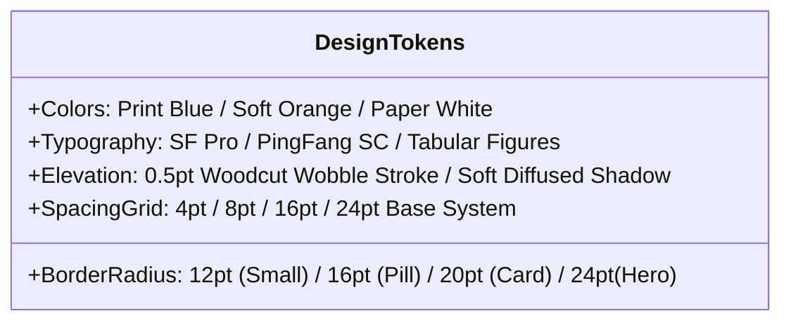
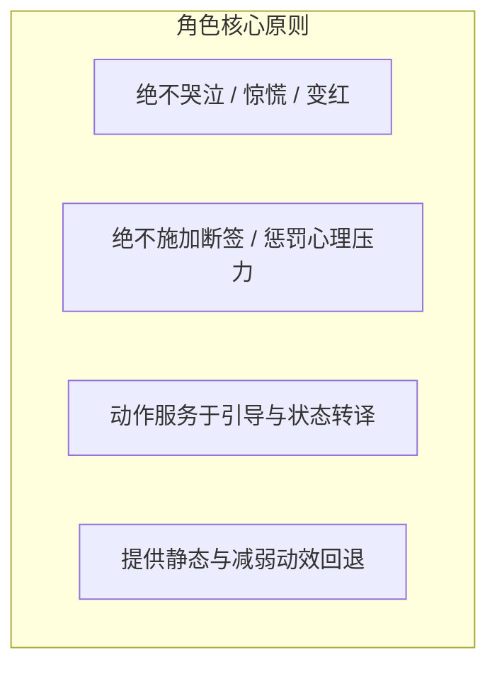
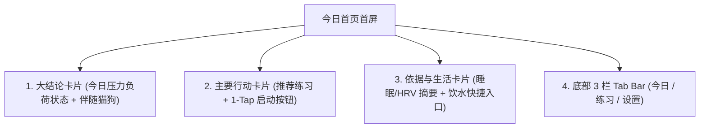
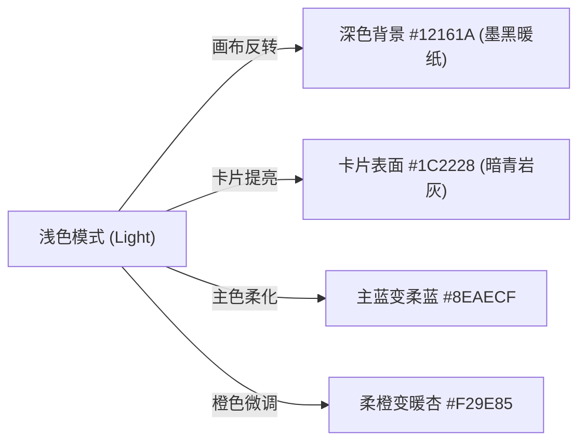

# 方寸 Fangcun App｜全套 UI 改造深化设计系统与完整规格文档
> **定案方向**：方案 A（轻版画日常）为主体骨架 ＋ 方案 B（情境姿态语义）为角色灵魂  
> **核心原则**：3 秒解答核心诉求；安静陪伴、高级幽默；无游戏化施压；本地优先；遵循原生 iOS HIG 规范。

---

## 目录
1. [设计系统基础规范 (Design Tokens)](#1-设计系统基础规范-design-tokens)
2. [猫狗角色姿态与互动规范 (Character & Posture System)](#2-猫狗角色姿态与互动规范-character--posture-system)
3. [12 大核心功能模块全套高保真规格 (Core Modules A-L)](#3-12-大核心功能模块全套高保真规格-core-modules-a-l)
   - [Module A. 初次使用与 Apple 健康连接](#module-a-初次使用与-apple-健康连接)
   - [Module B. 今日首页（平稳/偏高/数据不足/更新态/旧数据态）](#module-b-今日首页重点核心)
   - [Module C. 综合评估与「为什么这样判断」](#module-c-综合评估与为什么这样判断)
   - [Module D. 睡眠与恢复详情页](#module-d-睡眠与恢复详情页)
   - [Module E. 今日活动与训练详情页](#module-e-今日活动与训练详情页)
   - [Module F. 饮水与饮品复合快速记录（弹层+管理页）](#module-f-饮水与饮品复合快速记录)
   - [Module G. 练习库与练习详情页](#module-g-练习库与练习详情页)
   - [Module H. 练习进行中（呼吸/正念/NSDR全态）](#module-h-练习进行中沉浸态)
   - [Module I. 练习完成与轻量结算](#module-i-练习完成与轻量结算)
   - [Module J. 趋势与历史记录（周/月视图）](#module-j-趋势与历史记录)
   - [Module K. 设置、隐私与通用异常状态体系](#module-k-设置隐私与通用异常状态体系)
   - [Module L. Apple Watch 独立端延展](#module-l-apple-watch-独立端延展)
4. [深色模式 (Dark Mode) 适配体系](#4-深色模式-dark-mode-适配体系)
5. [无障碍与大字号 (Dynamic Type) 适配规范](#5-无障碍与大字号-dynamic-type-适配规范)
6. [设计交付文件结构与资产说明 (Figma Tokens & Assets)](#6-设计交付文件结构与资产说明)

---

## 1. 设计系统基础规范 (Design Tokens)

整套系统以**版画主蓝**、**柔和印章橙**与**温润暖纸白**为基底，结合矢量高清晰度排版与可控的边缘手工质感。



### 1.1 色彩阶梯与语义映射 (Color Tokens)

| Token 名称 | 浅色值 (Light) | 深色值 (Dark) | 界面语义与使用规则 |
| :--- | :--- | :--- | :--- |
| `color.brand.primary` | `#1B355A` (版画主蓝) | `#8EAECF` | 主要标题、导航激活项、主按钮底色、核心线框（WCAG AAA 对比度） |
| `color.brand.accent` | `#E07A5F` (柔和印章橙) | `#F29E85` | 角色点缀、轻量焦点徽章、完成印章；**禁止作为全局危险/警告色滥用** |
| `color.bg.canvas` | `#FAF9F5` (温润暖纸白) | `#12161A` | 全局背景色，温和不刺眼，呈现手工纸质基底 |
| `color.bg.surface` | `#FFFFFF` (纯白卡片) | `#1C2228` | 功能卡片、弹出层底色，配合 `0.5pt` 浅蓝版画描边 |
| `color.bg.tertiary` | `#F0F4F8` (极浅蓝灰) | `#252E36` | 次级按钮背景、输入步进器底槽、列表分割背景 |
| `color.text.primary` | `#1A2530` (深墨黑) | `#EDF2F7` | 页面大标题、结论主文案、核心数值 |
| `color.text.secondary` | `#5C6B7B` (石板灰蓝) | `#94A3B8` | 依据解释、辅助标签、副标题、图表单位 |
| `color.text.tertiary` | `#8E9FA5` (淡雾灰) | `#64748B` | 时间戳、次级单位、占位文字、禁用状态 |
| `color.status.steady` | `#3D7B80` (基准青蓝) | `#5FA4A9` | 平稳状态徽章、正常基线区间标识（客观平静） |
| `color.status.elevated`| `#C86D51` (负荷琥珀) | `#E5886E` | 偏高状态徽章、超负荷依据标记（必须伴随文字说明） |
| `color.status.neutral` | `#64748B` (中性灰) | `#8FA0B3` | 数据收集中、待同步、暂无数据状态 |

### 1.2 字体排印规范 (Typography Hierarchy)
- **字体族**：中文 `PingFang SC`（苹方），西文及数字 `SF Pro Text / SF Pro Rounded`。
- **排版原则**：文字与数字保持绝对清晰的矢量渲染，**严禁在正文与数值上施加磨损/噪点滤镜**。

| 样式层级 | 字号 (pt) | 行高 (pt) | 字重 (Weight) | 适用场景 |
| :--- | :--- | :--- | :--- | :--- |
| **Hero Title** | 26 | 32 | Bold (700) | 首页压力负荷核心结论 (`今日压力负荷平稳`) |
| **Title 1** | 20 | 26 | Semibold (600) | 一级卡片标题、模块大标题、练习名称 |
| **Title 2** | 17 | 22 | Medium (500) | 导航栏标题、弹层标题、二级分组名 |
| **Body Large** | 16 | 22 | Regular (400) | 依据主解释句、推荐练习描述 |
| **Body Regular** | 15 | 20 | Regular (400) | 常规正文、设置列表标题、弹层说明 |
| **Caption / Badge**| 13 | 16 | Medium (500) | 状态胶囊标签、时间戳、按钮副文本 |
| **Data Metric** | 22–32 | 34 | Rounded Bold | 睡眠小时、HRV 毫秒数值（采用等宽数字 `tnum`） |

### 1.3 描边、圆角与网格系统 (Layout & Surface Tokens)
- **基础网格**：`8pt` 空间网格，组件内边距基准 `16pt`，页面边缘外边距 `16pt`（大屏 Pro Max `20pt`）。
- **圆角梯度**：
  - 小徽章 / Tag：`8pt - 12pt`
  - 按钮 / 胶囊控件：`24pt`（全圆角 Pill）
  - 标准卡片：`20pt`
  - 底部弹层 (Bottom Sheet)：顶部 `24pt`
- **版画描边 (Woodcut Wobble Stroke)**：
  - 卡片外沿统一使用 `0.5pt` 浅蓝灰描边（Light: `#DCE4EC` / Dark: `#2E3A46`），带有微细手工起伏（SVG path wobble amplitude $\le 0.3\text{pt}$），杜绝机械冰冷感。
- **点击热区保障**：所有可交互元素（包括微小的加减号、撤销按钮、关闭图标）物理命中热区均强制 $\ge 44 \times 44\text{ pt}$。

---

## 2. 猫狗角色姿态与互动规范 (Character & Posture System)

猫狗来自确认稿，以「左猫右狗」为经典相对关系，具备安静陪伴、适度幽默的性格。



### 2.1 状态姿态矩阵 (Posture Matrix)

| 场景 / 状态 | 猫咪姿态 (Cat - 左) | 狗狗姿态 (Dog - 右) | 组合画面意象与设计意图 |
| :--- | :--- | :--- | :--- |
| **首页：平稳状态** | 挺直端坐，双眼微眯，尾尖轻卷 | 侧身趴下，下巴搭在前爪，耳朵微垂 | 惬意、松弛、秩序井然。不催促用户做任何事。 |
| **首页：偏高状态** | 坐在狗狗身边，前爪轻轻靠拢 | 整个身体完全舒展趴地，双眼闭合深呼吸 | 舒缓依偎、放慢节奏。传达“我们陪你停一下”。 |
| **首页：数据不足** | 坐在一个空白小方木块旁，歪头思考 | 趴着抬头，两只耳朵立起，眼神好奇 | 友好探询、自然等待。不给用户带来“没完成作业”的自责。 |
| **呼吸练习：吸气阶段** | 身体微微拉长挺拔，胸腔轻微扩张 | 抬头张开胸廓，鼻子微吸气，腹部饱满 | 直观引导吸气节拍（扩大 6-8%），避免机械跳动。 |
| **呼吸练习：呼气阶段** | 身体缓缓收缩，眼睛安详闭合 | 身体完全下沉贴地，吐出一缕手绘微气流 | 引导彻底释放交感神经张力。 |
| **NSDR / 卧式休息** | 蜷缩成一团小毛球，安静打呼 | 肚皮微露四脚摊开，头上带微小版画 `(zZ)` | 极度安静的睡眠诱导氛围。 |
| **饮品记录交互** | 坐在杯子旁，好奇看着杯子水线变动 | 前爪轻推杯托，操作完成后轻微摇一下尾巴 | 纯粹的交互响应反馈，**绝不根据饮品类别评判用户**。 |
| **练习完成结算** | 猫爪与狗爪在画面中央轻轻一碰 | 闭眼点头，身旁落下一枚柔橙色方寸小印章 | 节制、高级的轻量庆祝，无漫天烟花与彩带。 |

### 2.2 角色尺寸与显示标准
- **首页主卡片嵌入尺寸**：双角色组合宽度 `88pt`，高度 `56pt`，置于大结论卡片右上角或底角。
- **练习全屏引导尺寸**：双角色居中，宽度 `180pt - 220pt`，居于屏幕视线黄金分割点。
- **Tab Bar / Watch 微缩头像**：提取猫单头（`20x20pt`）与狗单头（`20x20pt`）极简线框。
- **动效减弱模式 (Reduce Motion)**：系统开启减弱动效时，角色保持完全静态版画构图，呼吸引导以平滑透明度光晕（Opacity 0.3 $\leftrightarrow$ 1.0）代替肢体形变。

---

## 3. 12 大核心功能模块全套高保真规格 (Core Modules A-L)

---

### Module A. 初次使用与 Apple 健康连接

```
┌────────────────────────────────────────┐
│ ✕ 跳过 (直接体验)                      │
│                                        │
│          /\_/\        __               │
│         ( o.o )      /  \___           │
│         (  u u)      \  (o.o)          │
│                                        │
│ 欢迎来到「方寸」                       │
│ 理解身体压力，找回当下节奏。          │
│                                        │
│ ┌────────────────────────────────────┐ │
│ │ ✦ 我们如何评估压力负荷？            │ │
│ │ · 睡眠时长与规律性（夜间恢复基石）  │ │
│ │ · 心率变异性 HRV（自主神经平衡度）  │ │
│ │ · 运动与静息心率（身体疲劳与消耗）  │ │
│ └────────────────────────────────────┘ │
│                                        │
│ 🔒 数据严格保存在本设备，无需注册账号 │
│                                        │
│ [ 连接 Apple 健康数据 ▶ ]              │
│ [ 暂不连接，先去练习 ]                 │
└────────────────────────────────────────┘
```

- **页面目标**：讲清“用什么数据、为什么有用、如何保护隐私”，提供无损退路。
- **信息层级**：
  1. 顶部跳过入口（`✕`，点击直接进入练习库）。
  2. 蓝橙版画猫狗欢迎插图（猫狗并排坐，画面友好温润）。
  3. 核心说明卡：用 3 个简短 Bullet 说明睡眠、HRV、心率与压力的科学关系。
  4. 隐私背书：明确标注 `所有健康数据仅在本地读取与计算，不上传任何云端服务器`。
  5. 明确的主次 CTA：
     - 主按钮：`[ 连接 Apple 健康数据 ▶ ]`（调用系统原生 HealthKit 授权 Sheet）。
     - 次按钮：`[ 暂不连接，先去练习 ]`（直接进入完全可用的呼吸与 NSDR 模块）。
- **异常与边界处理**：
  - 若系统返回部分权限或未授权，绝不提示“权限被拒绝/操作失败”，而是展示：`已进入本地模式。你可以随时在设置中开启自动分析。`

---

### Module B. 今日首页（重点核心）

首页是产品的绝对中枢，严格遵循“3 秒得出结论”的架构：



#### 状态 B1：平稳状态 (Steady)
```
┌────────────────────────────────────────┐
│ 9月17日 星期四                  Watch ● │
│ 早上好                           09:15 │
│                                        │
│ ┌────────────────────────────────────┐ │
│ │ [ ✦ 今日压力负荷平稳 ]               │ │
│ │                                /\_/\ │
│ │ 昨夜睡眠充沛（7h20m）          (o.o ) │
│ │ 生理恢复指标处于基线范围。     ( u u) │
│ └────────────────────────────────────┘ │
│                                        │
│ ┌────────────────────────────────────┐ │
│ │ 推荐行动 · 3分钟节律呼吸            │ │
│ │ 维持平稳专注状态    [ 开始练习 ▶ ]  │ │
│ └────────────────────────────────────┘ │
│                                        │
│ ┌──────────────────┐ ┌───────────────┐ │
│ │ 📊 依据摘要       │ │ ☕ 生活记录   │ │
│ │ 睡眠 7h20m 良好   │ │ 今日尚未记录 │ │
│ │ HRV 58ms 基线内   │ │ [ + 记一杯 ] │ │
│ └──────────────────┘ └───────────────┘ │
│                                        │
│ ────────────────────────────────────── │
│   [● 今日]        [○ 练习]     [○ 设置] │
└────────────────────────────────────────┘
```
- **核心元素规格**：
  - 顶部状态条：显示日期、时间与 Watch 同步指示（绿色实心小点代表“刚刚同步”）。
  - 主卡片：`今日压力负荷平稳` 大标题，配以青蓝标签 `[ ✦ 今日压力负荷平稳 ]`；右上角猫咪微眯眼、狗狗前爪趴地。
  - 主推荐卡：`推荐行动 · 3分钟节律呼吸`，带实色主按钮 `[ 开始练习 ▶ ]`。
  - 下方双列卡：左侧点开直达依据详情，右侧点开直达饮品快速记录。

#### 状态 B2：偏高状态 (Elevated)
- **大结论卡片**：
  - 标签：`[ ▲ 今日压力负荷偏高 ]`（柔橙色背景 `#FDEEE9`，文字 `#C86D51`）。
  - 解释句：`睡眠不足叠加高强度训练，身体恢复指标低于基线。`
  - 右上角猫狗：猫咪轻靠狗狗身边，狗狗完全趴地闭眼休息，氛围宁静舒缓。
- **主行动卡片**：
  - 标题：`推荐行动 · 5分钟生理性叹息`。
  - 描述：`快速平抑交感神经张力，重置心率节奏。`
  - 主按钮：`[ 立即缓解 ▶ ]`。
- **依据摘要**：`昨夜睡眠 5h10m (-2h)` · `HRV 36ms (偏低)`。

#### 状态 B3：数据不足 / 基线建立中 (Insufficient Data)
- **大结论卡片**：
  - 标签：`[ ◌ 暂时无法判断 ]`（中性灰底色 `#EEF2F6`）。
  - 标题：`需要更多数据建立基线`。
  - 解释句：`昨夜未获取睡眠数据；佩戴手表入睡 5 天后将自动生成精准分析。`
  - 右上角猫狗：猫狗坐在空白小木块前好奇探头。
- **主行动卡片**：
  - 标题：`随时开启 · 自由呼吸练习`。
  - 主按钮：`[ 挑选练习 › ]`。

#### 状态 B4：数据正在更新中 (Updating State)
- 顶部时间右侧显示版画风格的极细旋转双圆弧，大卡片文字保持上一次读数，但下方显示微小提示：`正在从 Apple Watch 读取晨间心率...`，完成后平滑淡入新结论。

#### 状态 B5：使用昨日旧数据 (Stale Data State)
- 若超过 18 小时未同步，卡片标签显示：`[ ⏱ 显示昨日历史结论 ]`，下方主按钮变为 `[ 同步最新健康数据 ]`，**绝不把旧数据伪装成今日新状态**。

---

### Module C. 综合评估与「为什么这样判断」

从首页点击依据摘要卡片后，从底部推入的全屏详情页（带原生 Large Navigation Title 与左上角 `✕ 关闭`）。

```
┌────────────────────────────────────────┐
│ ✕ 为什么这样判断？                     │
│ 9月17日 09:15 评估 · 数据来源: Apple健康│
│                                        │
│ ┌────────────────────────────────────┐ │
│ │ 1. 身体恢复与睡眠 (核心权重)       │ │
│ │ · 昨夜睡眠：7h 20m（基线 7h15m 充沛）│ │
│ │ · 晨间 HRV：58 ms（基准 52-62 ms）  │ │
│ │ · 静息心率：59 bpm（基线 60 bpm）   │ │
│ │ ─── HRV 7天趋势折线图 (基线带阴影) ─ │ │
│ └────────────────────────────────────┘ │
│                                        │
│ ┌────────────────────────────────────┐ │
│ │ 2. 近期身体活动                     │ │
│ │ · 昨日慢跑 30 分钟（恢复充分）      │ │
│ │ · 今日日常步数 2,140 步             │ │
│ └────────────────────────────────────┘ │
│                                        │
│ ┌────────────────────────────────────┐ │
│ │ 3. 今日生活背景                     │ │
│ │ · 饮水 650ml · 咖啡因 0mg           │ │
│ │ *生活记录仅作为参考背景，不武断归因 │ │
│ └────────────────────────────────────┘ │
│                                        │
│ [ 基于当前状态，开始 3分钟呼吸 ▶ ]     │
└────────────────────────────────────────┘
```

- **科学呈现原则**：
  1. **分区明确**：明确区分「身体恢复与睡眠（客观生理）」、「近期活动（体力负荷）」与「手动生活记录（背景环境）」。
  2. **基线参照系**：所有数值均标注个人基线区间（如 `HRV 58ms [基线 52-62ms]`），避免让用户对着单一无意义数字猜测。
  3. **拒绝虚假因果关系**：明确标注客观背景，**绝对不画出“因为你喝了这杯咖啡导致压力升高”等缺乏临床确认的因果箭头**。
  4. 底部常驻 CTA：直接连接到最适宜的练习流程。

---

### Module D. 睡眠与恢复详情页

- **核心内容**：
  - 睡眠总量与入睡/醒来时间（如 `23:45 - 07:05 · 7h 20m`）。
  - 恢复评估卡：结合夜间静息心率下沉曲线（Dipping Curve）用平实的语言解释：“心率在凌晨 3 点达到最低谷，说明身体已完成深层代谢恢复”。
- **三种数据状态覆盖**：
  - **完整数据**：显示睡眠阶段（深睡、核心、快速眼动）的极简版画双色横向比例条。
  - **部分数据**：仅有卧床时长、无阶段数据时，显示“已记录在床时长，睡眠阶段数据待手表补全”。
  - **无记录**：显示清爽的手绘空床小插画，附带文案“昨晚未佩戴手表入睡”，并保留手动添加入口。

---

### Module E. 今日活动与训练详情页

- **智能去重规则**：
  - 若用户在 Apple Watch 上记录了一次 45 分钟力量训练，同时 Apple 健康中写入了日常步行，页面在视觉上合并呈现为：`正式训练 1 次 (45min) + 日常活动 3,200 步`，**绝不在总量统计中重复累计消耗**。
- **力量训练与恢复识别**：
  - 若未检测到力量训练，展示为客观的 `暂无训练记录`，而非武断判定 `用户未运动`。
  - 针对高强度训练后的心率升高，单独设立说明卡：“运动后数小时内核率偏高属于正常的机体修复过程，不直接等同于心理焦虑”。

---

### Module F. 饮水与饮品复合快速记录

这是降低用户记录心智负担的核心突破口，提供**半屏 Native Bottom Sheet 快捷点选**与**完整管理页**。

```
┌────────────────────────────────────────┐
│ ─── (Drag Handle) ───                  │
│ 记录今日饮品                    [完成] │
│                                        │
│ 💧 水分摄入                            │
│    [ - ]      600 ml      [ + ]        │
│    快捷: [+250ml]  [+500ml]            │
│                                        │
│ ☕ 咖啡因 (咖啡 / 茶 / 能量饮料)       │
│    [ - ]   2 杯 (约280mg)  [ + ]       │
│    预设: 1标准美式=140mg (点击可微调) │
│                                        │
│ 🍺 酒精          🧃 含糖饮料           │
│    [ 0 杯 ]          [ 0 瓶 ]          │
│                                        │
│ ────────────────────────────────────── │
│ [ ↩ 撤销上一笔 (+250ml) ]             │
└────────────────────────────────────────┘
```

- **四大品类录入逻辑**：
  1. **水 (Water)**：以 `250ml` 为标准步长，点 `+` 即时累加，也可直接点快捷标签。
  2. **咖啡因 (Caffeine)**：以杯为单位，自动根据常用规格换算毫秒数（标注“预估值”），支持在设置中自定义单杯克数。
  3. **酒精 (Alcohol)**：选择标准杯（如 1 罐啤酒 / 1 杯红酒 = 1 标准份，约 10g 纯酒精），不强迫用户计算度数。
  4. **含糖饮料 (Sugar)**：以“瓶/杯”录入，不伪造不可靠的精确白砂糖克数。
- **复合属性一键录入 (Smart Composite Input)**：
  - 录入“1 杯拿铁”时，系统后台自动累计为：`咖啡因 +140mg` 与 `液体水分 +300ml`，无需用户分两次输入。
- **极致容错**：
  - 底部提供醒目的 `[ ↩ 撤销上一笔 ]` 按钮。
  - 允许在历史页任意修改、清空某项记录。
  - **角色无评判**：无论记录 0 杯水还是 3 杯咖啡，猫狗均仅做微小碰杯动作，绝无批评/愤怒/哭泣表情。

---

### Module G. 练习库与练习详情页

采用清晰的意图分组（Intent-based Groups），入口不依赖任何强制情绪问卷：

```
┌────────────────────────────────────────┐
│ 练习库                          ⚙ 设置 │
│ 挑选适合当下的呼吸与休息方式           │
│                                        │
│ ┌── 今日推荐 ────────────────────────┐ │
│ │ ✦ 5分钟 生理性叹息 (Physiological) │ │
│ │ 最快平抑心率与压力的双吸一呼呼吸法 │ │
│ │ 姿势: 坐姿/站姿   时长: 5 分钟     │ │
│ │                  [ 立即开始 ▶ ]    │ │
│ └────────────────────────────────────┘ │
│                                        │
│ ┌── 压力缓解 ────────────────────────┐ │
│ │ 🫁 4-7-8 节律呼吸     · 3-5分钟     │ │
│ │ 🌿 4-4-4-4 箱式呼吸   · 4分钟       │ │
│ └────────────────────────────────────┘ │
│                                        │
│ ┌── 深度恢复与睡眠 ──────────────────┐ │
│ │ 🛋 NSDR 卧式深度休息  · 10-20分钟   │ │
│ │ 🌙 睡前正念身体扫描   · 15分钟      │ │
│ └────────────────────────────────────┘ │
│ ────────────────────────────────────── │
│   [○ 今日]        [● 练习]     [○ 设置] │
└────────────────────────────────────────┘
```

- **练习详情弹层 (Practice Detail Sheet)**：
  - 点击卡片弹出，清晰展示：
    1. **科学原理与用途**（如“通过延长呼气时间激活迷走神经”）。
    2. **推荐身体姿势**（坐直、平躺、闭眼）。
    3. **时长选择器**：`[ 3分钟 | 5分钟(推荐) | 10分钟 ]`。
    4. **大主按钮**：`[ 准备开始练习 ▶ ]`。

---

### Module H. 练习进行中（沉浸态）

针对**呼吸类（节律性）**与**NSDR/正念类（阶段性音频）**提供针对性的引导界面。

#### 场景 H1：5 分钟生理性叹息呼吸 (Breathing In-Session)
```
┌────────────────────────────────────────┐
│ ✕ 结束练习                   🔊 触感开 │
│                                        │
│                                        │
│                 /\_/\                  │
│                ( o.o )                 │
│               (   u   ) 腹部扩张       │
│                                        │
│             ╭───────────╮              │
│            │  大口吸气  │              │
│             ╰───────────╯              │
│            (再补吸一小口)              │
│                                        │
│                                        │
│                 03:42                  │
│               剩余 3 分钟              │
│                                        │
│           [   ⏸ 暂停练习   ]           │
└────────────────────────────────────────┘
```
- **节拍节奏传达**：
  1. 画面中央猫咪腹部缓缓扩张，配合柔和版画扩散圆环。
  2. 节拍文字：`大口吸气 (吸满80%)` $\rightarrow$ `再补吸一口 (完全吸满)` $\rightarrow$ `缓慢叹气 (自然呼出)`。
  3. 触感协同：吸气时 Taptic Engine 呈现连续细腻微振，呼气时振动完全静止。
  4. 随时退出机制：点击 `✕ 结束练习` 弹出半透明提示：`练习已进行 1分18秒，是否确认保存并退出？`，包含 `[ 继续练习 ]` 与 `[ 结束并记录 ]`，毫无任何羞耻感提示。

#### 场景 H2：NSDR 躺式休息 / 正念 (NSDR In-Session)
- **视觉去节拍化**：不采用机械呼吸圆环。
- 画面中央为猫狗蜷缩安睡的宁静版画插画；
- 显示当前音频引导阶段：`第一阶段 · 身体重量感知与下沉`；
- 屏幕自动渐暗至超低对比度（10% 亮度），防止夜间刺眼。

---

### Module I. 练习完成与轻量结算

```
┌────────────────────────────────────────┐
│                                        │
│                                        │
│               ╭───────╮                │
│               │ 方 寸 │ (橙色印章)     │
│               │ 平 稳 │                │
│               ╰───────╯                │
│               /\_/\   __               │
│              ( =.= ) /o.o) (碰爪)      │
│                                        │
│              练习已完成                │
│     5分钟 生理性叹息 · 已保存至健康    │
│                                        │
│ ┌────────────────────────────────────┐ │
│ │ 练后感受 (可选，不选直接点完成)    │ │
│ │  [ 🌿 轻松许多 ]    [ 😐 差不多 ]   │ │
│ └────────────────────────────────────┘ │
│                                        │
│ [ 返回今日首页 ▶ ]                     │
└────────────────────────────────────────┘
```

- **轻量确认**：猫狗在画面中轻轻碰爪，上方盖下一枚柔橙色版画印章。
- **诚实呈现**：绝不谎称“你的压力已经下降了 30%”，而是明确标注 `已记录本次练习 (5分钟)`。
- **可选反馈**：提供 2 个极简可选标签，不填写可直接点击主按钮 `[ 返回今日首页 ]`，1 秒顺畅返回。

---

### Module J. 趋势与历史记录

整合在设置二级页或独立分析入口中，支持**周/月视图**切换。

```
┌────────────────────────────────────────┐
│ ‹ 返回                  历史与趋势 ⚙ │
│ [ 周视图 ]          [ 月视图 ]         │
│                                        │
│ 9月14日 - 9月20日                      │
│                                        │
│  一   二   三   四   五   六   日      │
│  ●    ▲    ●    ●    ○    ○    ○       │
│ 平稳 偏高 平稳 平稳 (未发生/待更新)    │
│                                        │
│ ┌── 选中：9月15日 周二 ──────────────┐ │
│ │ 结论：今日压力负荷偏高              │ │
│ │ 依据：睡眠 5h10m · 力量训练 45m    │ │
│ │ 行动：已完成 5分钟叹息呼吸 x1       │ │
│ │ 生活：饮水 650ml · 咖啡因 280mg     │ │
│ └────────────────────────────────────┘ │
│                                        │
│ 📊 7天规律性洞察                       │
│ 睡眠时长在 7 小时以上时，恢复指标均保  │
│ 持在基线区间。                         │
└────────────────────────────────────────┘
```

- **严谨的数据展示规则**：
  - 缺失数据天：清晰展示为空心圆圈 `○` 或留白，**绝不自动脑补或补成平稳**。
  - 点击任意一天，下方联动展示当天的完整结构化快照。
  - 趋势洞察基于客观统计，不输出绝对因果承诺。

---

### Module K. 设置、隐私与通用异常状态体系

#### 设置页结构 (Settings Hierarchy)
1. **Apple 健康连接**：权限状态、重新授权入口、同步时间戳。
2. **偏好设置**：
   - 声音与触感（背景白噪音、人声引导音量、Taptic 节拍强度）。
   - 动效设置（随系统 / 强制静态版画模式）。
   - 饮品预设规格管理（自定义 1 杯咖啡默认咖啡因克数）。
3. **数据管理与隐私**：
   - 本地数据导出（CSV / JSON 格式导出）。
   - 清除本地记录（明确提示：*仅清除本 App 本地生活与练习记录，不会删除 Apple 健康中的原生数据*）。
4. **关于方寸**：版本号、科学参考来源、双色版画设计说明。

#### 全局通用状态规范 (Universal States)

| 状态 | 界面表现 | 引导与恢复动作 |
| :--- | :--- | :--- |
| **空数据 (Empty)** | 居中版画空白笔记本插图，猫咪端坐 | `暂无记录。今天从一次 3 分钟呼吸开始吧。` |
| **加载中 (Loading)** | 顶部导航栏微细版画双圆环旋转 | 骨架屏采用 `#F0F4F8` 浅色块平滑占位 |
| **同步失败 (Sync Error)** | 导航栏右侧显示小警告标 `Watch ⚠` | 点击弹出：`与手表连接超时，已使用本地缓存。点击重试` |
| **保存失败 (Save Failure)**| 底部弹出轻量 Toast | `本地记录已保存，健康数据待稍后重新同步 [重试]` |

---

### Module L. Apple Watch 独立端延展

遵循 watchOS HIG 规范，为手腕端打造大触控目标、高对比度的极简体验。

```
┌──────────────────────┐
│ 09:15          [●]   │
│                      │
│ ✦ 负荷平稳           │
│ 睡眠充足 7h20m       │
│                      │
│ [ 🫁 3min 呼吸 ▶ ]   │
│                      │
│ (水 600ml | 咖啡 2杯)│
└──────────────────────┘
 (Watch 首页表盘卡)

┌──────────────────────┐
│ 03:42                │
│                      │
│        /\_/\         │
│       ( o.o ) (鼓起) │
│                      │
│       深吸气...      │
│  ●●●○○○○○○○○○○○○○○   │
└──────────────────────┘
 (Watch 呼吸引导中)
```

- **表盘核心要素**：
  - 单屏仅保留 1 个核心结论 + 1 个大尺寸启动按钮（高度 48pt，全表盘宽度）。
  - 猫狗在手表端简化为单只猫咪或狗狗头像轮廓（去掉细碎版画颗粒，保持清晰矢量）。
  - 手腕独立 Taptic Engine 提供清晰的吸呼长短振动，**用户闭上眼睛完全凭手腕振动即可完成全套练习**。

---

## 4. 深色模式 (Dark Mode) 适配体系

深色模式不仅是颜色反转，而是还原“夜间在暗调手工纸上盖上深蓝印章与柔橙光泽”的艺术氛围。



### 深浅色彩对照表与设计规则

| 元素 | 浅色模式 (Light) | 深色模式 (Dark) | 深色模式适配原则 |
| :--- | :--- | :--- | :--- |
| **全局底色** | `#FAF9F5` (温润暖纸白) | `#12161A` (深墨黑纸) | 避免使用刺眼的 OLED 纯黑 `#000000`，保持暖调质感 |
| **卡片底色** | `#FFFFFF` (纯白) | `#1C2228` (暗青岩灰) | 与底色形成清晰层级，外框使用 `0.5pt #2E3A46` 描边 |
| **猫狗轮廓线条** | `#1B355A` (深蓝) | `#8EAECF` (柔淡青蓝) | 降低线条对比度，防止夜间发光刺眼 |
| **猫狗身体填充** | `#FFFFFF` (纯白) | `#252E36` (深青灰) | 避免全白大色块在夜间造成眩光 |
| **柔橙点缀** | `#E07A5F` | `#F29E85` (暖杏橙) | 提升暗部明度，确保点缀辨识度 |
| **主按钮底色** | `#1B355A` (深蓝) | `#8EAECF` (浅亮蓝) | 文字随之反转为 `#12161A`，维持 WCAG AAA 可读性 |

---

## 5. 无障碍与大字号 (Dynamic Type) 适配规范

方寸面向所有成年人群，必须全面支持 iOS Dynamic Type 与 VoiceOver 旁白读取。

```
┌────────────────────────────────────────┐
│ 9月17日 星期四                  Watch ● │
│                                        │
│ ┌────────────────────────────────────┐ │
│ │ [ ✦ 今日压力负荷平稳 ]               │ │
│ │                                    │ │
│ │ 今日压力负荷平稳                   │ │
│ │                                    │ │
│ │ 昨夜睡眠充沛（7小时20分钟），     │ │
│ │ 生理恢复指标处于正常基线范围。     │ │
│ │                                    │ │
│ │               /\_/\    __          │ │
│ │              (o.o )   /o.o)        │ │
│ └────────────────────────────────────┘ │
│                                        │
│ ┌────────────────────────────────────┐ │
│ │ 推荐行动                           │ │
│ │ 3分钟节律呼吸                      │ │
│ │ [       开始练习 ▶       ]         │ │
│ └────────────────────────────────────┘ │
└────────────────────────────────────────┘
 (Dynamic Type AX3 超大字号自适应布局)
```

### 5.1 大字号排版自适应策略
1. **容器流式扩展**：卡片高度取消固定值（Fixed Height），全部采用 Auto Layout 纵向撑开。
2. **图文关系降级**：
   - 正常字号下：猫狗插图置于卡片右上角（并排排布）。
   - 极大字号 (Accessibility Sizes) 下：文字独占全宽，猫狗插图自动移至文字正下方居中排列，**绝不截断任何中文文本**。
3. **按钮自适应**：主按钮从横向并排自动折行为全宽垂直堆叠（Vertical Stack）。

### 5.2 VoiceOver 读屏无障碍标签规范
- **装饰性角色过滤**：猫狗插画默认标记为 `isAccessibilityElement = false`，读屏焦点不会反复停留在装饰图形上。
- **状态与结论组合读取**：大卡片聚合为一个 Accessibility Container，读屏播报：`"今日压力负荷平稳。依据：昨夜睡眠充沛7小时20分钟，生理恢复指标处于基线范围。按钮：开始3分钟节律呼吸"`。
- **饮品步进器**：`+` 按钮播报 `"增加水分250毫升，当前累计600毫升"`。

---

## 6. 设计交付文件结构与资产说明

### 6.1 Figma 文件规范与图层组织
- **📐 01_Design Tokens & Styles**：Color Variables (Light/Dark)、Typography System、Spacings & Wobble Strokes。
- **🐱 02_Character Components**：Cat & Dog Postures (Variants: Steady, Elevated, Neutral, In-Practice, Drinking, Completed, Reduced-Motion)。
- **🧩 03_Universal Components**：Buttons, Badges, Cards, Steppers, Sliders, TabBar, Modal Sheets, Charts。
- **📱 04_iOS Screens (Light Mode)**：12 类核心页面完整状态流。
- **🌙 05_iOS Screens (Dark Mode)**：全套深色模式适配画板。
- **🔤 06_Accessibility & Responsive**：iPhone SE (375pt) / iPhone 16 Pro (393pt) / Dynamic Type AX3。
- **⌚ 07_watchOS Screens**：41mm & 45mm 表盘完整链路。

### 6.2 导出资产清单 (Assets Delivery)
- **猫狗插画资产**：
  - 导出格式：高清透明背景 `PNG @2x / @3x` 与可控精细网点的 `PDF (Vector with Texture Map)`。
  - 保留版画边缘与轻度留白，严禁使用粗糙位图硬转矢量导致的毛刺失真。
- **界面功能图标**：
  - 导出格式：标准 `SVG` 矢量符号，符合 SF Symbols 规范（24x24pt 容器，2pt 描边宽度）。
